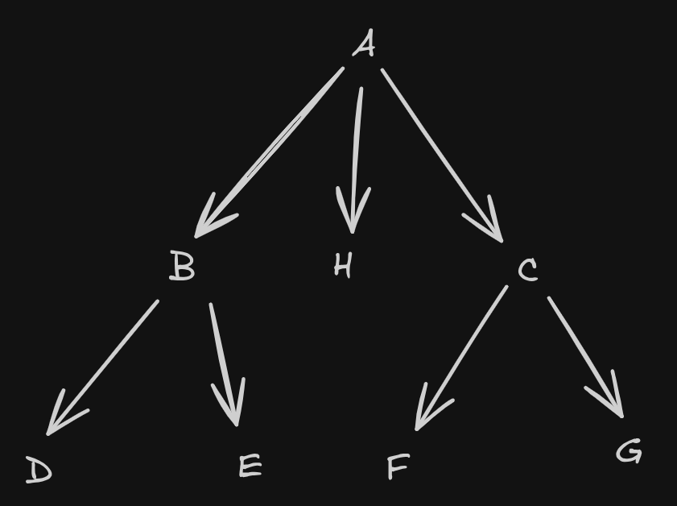
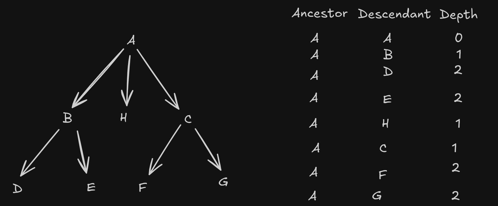

# Products Service & Category Hierarchy

This microservice handles product data, focusing
on [Products](src/main/java/dev/maddock/minimeli/productsservice/entity/Product.java)
and their hierarchical [Categories](src/main/java/dev/maddock/minimeli/productsservice/entity/Category.java).

## Technical deep dive: Category hierarchy

### The problem: Modeling an e-commerce catalog

Categories are rarely flat. They form a complex tree structure (e.g., *Technology > Smartphones > Apple > iPhone*).

I considered two naive approaches before settling on a hierarchy:

1. **Single Category:** Limits the product to one bucket. If an iPhone is categorized only as "Technology", a user
   searching for "Phones" won't find it. If categorized only as "iPhone", a user searching for "Technology" misses it.
2. **Multiple Categories (Tags):** Solves the visibility issue but creates a perverse incentive for sellers to "spam"
   categories (tagging an iPhone as "Home & Garden" just to appear in searches), degrading the user experience.

**The Solution:** A strict Hierarchy.
Products belong to a specific leaf or node (e.g., "iPhone"). The system understands that an "iPhone" **is-a** "
Smartphone" and **is-a** "Technology" product.

* **For the Buyer:** Searching "Technology" implies searching all its descendants.
* **For the Seller:** They classify specifically, but get broad visibility automatically.

### Implementation: Closure Table vs. Recursive CTEs

To map this hierarchy in a relational database, I implemented the **Closure Table** pattern designed in pure Java/JPA.

**Why not Recursive CTEs (Adjacency List)?**
While a standard `parent_id` (Adjacency List) is simple to write, reading a full subtree requires recursive SQL
queries (`WITH RECURSIVE`).

* **Pros:** Simple writes.
* **Cons:** Read complexity increases with tree depth. In high-scale e-commerce, **reads >> writes** (categories are
  read millions of times but rarely modified). We need to optimize for retrieval speed.

**Why Closure Tables?**
A Closure Table pre-calculates and stores **every** ancestor-descendant relationship.

* **Trade-off:** We sacrifice some storage space and write complexity (on insertions/moves) to achieve **O(1) read
  performance**.
* **Implementation:** I chose a pure Java/JPA approach over vendor-specific solutions like PostgreSQL's `ltree` to
  maintain database agnosticism and keep business logic testable within the application layer.

### How it works

The source of truth is still the [Category](src/main/java/dev/maddock/minimeli/productsservice/entity/Category.java)
entity with a `parent_id`. However, we maintain a side-car structure:
the [CategoryPath](src/main/java/dev/maddock/minimeli/productsservice/entity/CategoryPath.java).

**Visualizing the problem:**
Fetching all products under "Category A" (including B, C, D, E...):



With a Closure Table, instead of traversing the tree at runtime, we simply query the pre-computed paths:

```sql
-- Get all descendants of 'A' in O(1)
SELECT descendant_id
FROM category_path
WHERE ancestor_id = 'A';
```

This allows for extremely efficient product lookups:

```sql
SELECT *
FROM product
WHERE category_id IN (SELECT descendant_id FROM category_path WHERE ancestor_id = '<target category ID>');
```

The [CategoryPathService](src/main/java/dev/maddock/minimeli/productsservice/service/impl/CategoryPathServiceImpl.java)
handles the logic to keep these paths in sync whenever a category is created or moved.

Here's what a closure table for the A category would look like:

